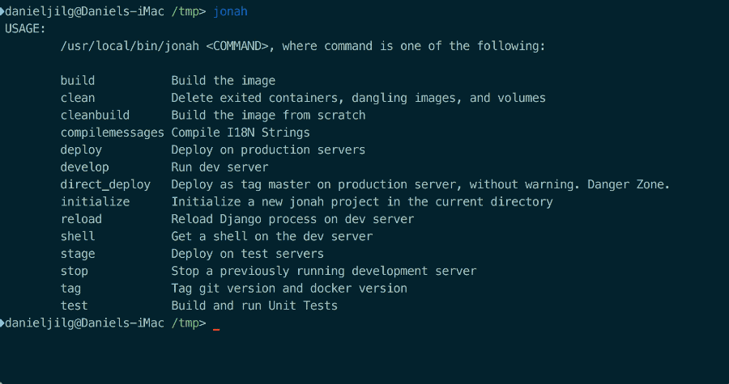

Jonah is a way to pack your Django Development, Deployment and Testing into Docker
==================================================================================

**Using Jonah, you can develop your Django application entirely within Docker.** This way, your code runs in the exact
same environment, whether it's on your machine, on the test server, or in deployment. Jonah saves you a lot of the
setup work in the beginning, letting you jump into a fully prepared, but configurable, Django Docker Project.

If you are using TDD, you can include Jonah on your build server to make sure all tests pass before pushing it to your
staging or production servers.

----




Getting Started
---------------

You can install Jonah using ``pip``:

::

    > pip install jonah

Then run it using the ``jonah <command>`` syntax. To start a new project, run

::

    > jonah initialize your_new_project

Jonah will then create a new directory called ``your_new_project`` in the current working directory and create an empty
Django project inside.

Developing Your Project
~~~~~~~~~~~~~~~~~~~~~~~

To run your new empty project, run ``jonah develop``:

::

    > cd your_new_project
    > jonah develop

This will build and launch the container, then launch the Django project inside the container. If you get any error
messages, check if your computer has a working and current installation of Docker. To check if your project is running,
visit ``http://localhost/`` (port 80) in your browser.

The ``ddp`` directory inside your project directory is transparently mounted into the container, so that any changes in
your code are directly applied to the running code. (For some changes, you might have to reload the Django server, but
more on that later.)

Most of the time when developing a Django application, you don't need to restart the development server constantly. For
changes to models, settings, or changes to ``admin.py``, you can reload the Django server using this command:

::

    > jonah reload

Getting A Shell
~~~~~~~~~~~~~~~


Now, let's start a new app inside the project. To do that, you can use Jonah's ``shell`` feature. Open a shell inside
the container like so:

::

    > jonah shell

After a moment, you should see a new prompt looking something like ``root@a0e9d20bffdf:/code#`` to indicate you're
working inside the container. Change the working directory into the ``ddp`` dir and run the ``manage.py`` command like
you would normally:

::

    > cd ddp
    > ./manage.py startapp my_new_app

Congratulations! You just ran Django code inside your container. It is recommended that you run ``makemigrations``,
``migrate``, and other ``manage.py`` commands like this as well. Type ``exit`` to exit the container shell and return
to your regular command line.

Running Tests
~~~~~~~~~~~~~

``jonah test`` will run all your tests in the container and display live output.

Stopping the Container
~~~~~~~~~~~~~~~~~~~~~~

Once you're calling it quits after a long day of productive coding, use ``jonah stop`` to shut down your container.
Happy coding. :)

Moving an Existing Project to Jonah
-----------------------------------

Jonah is easiest to use when you start a new project. However, it should work with any directory that has a
``Dockerfile`` and a ``jonah.ini`` file. A good way to move a Django project into Jonah would probably be the following:

1. Rename your Django project to ``ddp``
2. Create a new Jonah project with the name of your Django project
3. Replace the ddp directory inside Jonah by your own
4. Profit


Full List of Commands
---------------------

===================== ==================================================================================================
Command               Description
===================== ==================================================================================================
``initialize``	      Initialize a new jonah project in the current directory
``build``             Build the image.
``cleanbuild``        Build the image from scratch instead of relying on cached layers.
``develop``   	      Run dev server
``reload``    	      Reload Django process on dev server
``shell``     	      Get a shell on the dev server
``stop``      	      Stop a previously running development server
``test``      	      Build and run Unit Tests
``compilemessages``	  Compile internationalization Strings
``tag``       	      Add git and docker tags
``deploy``    	      Deploy to production. This command will ask you for a tag before pushing anything to the server
``stage``     	      Deploy to staging
``direct_deploy``	  Deploy as tag "master" on production server, without warning and without asking for confirmation
``clean``             Delete exited containers, dangling images, and volumes. Good to clean up hard drive space.
===================== ==================================================================================================

To get a full list of commands, run ``deploy.py`` without any arguments.


Configuration
-------------

The ``initialize`` command will create a number of configuration files. Here is what they are used for:

============================= ==========================================================================================
File                          Description
============================= ==========================================================================================
``jonah.ini``                 General configuration for jonah, most importantly the Docker image name
``requirements.txt``          This file is in Pip-Syntax. Python packages found here will be installed into the Docker
                              container.
``test.sh``                   A shell script to run your tests. In many cases, this should just contain
                              ``manage.py test``, but maybe you want to create code coverage, or include nose, or
                              transform unit test results to other formats for your build server to use.
``jonah/apt-packages.txt``    This file is in apt-get syntax. System packages that will be installed after basic system
                              installation is complete.
``jonah/supervisord.conf``    Config file for supervisord. By default, this runs ``spinup.sh``, then starts
                              gunicorn and the Django server.
``jonah/nginx.conf``          Config file for nginx. Look at this if you want to e.g. setup different static file
                              handling.
``jonah/spinup.sh``           A shell script to run EVERY TIME the container is spun up.
``jonah/finalize_build.sh``   A shell script to run ONCE after the system installation has finished.
============================= ==========================================================================================


Sidebar: Why ``ddp``?
---------------------
What is the meaning of the ``ddp`` directory?

While a Jonah project can have any name, the *Django project* it encapsulates *needs* to be called ``ddp``, so all
the scripts and calls inside Jonah know where to find the Django project, how to specify settings, etc. "DDP" stands
for "Docker Deployable Project".

While this constraint could be lifted in the future, it is not very high on our list of priorities right now. If you
feel differently, please let us know by opening or adding to an issue on GitHub.

Help Out and Code of Conduct
----------------------------

We’d like to encourage your feature requests, bug reports and pull requests. Please note that the
`Django Code of Conduct`_ applies to this project. Be friendly, welcoming, considerate, respectful, and be careful
in the words that you choose please. If you think you’ve witnessed a CoC violation, please contact Daniel.

Heritage
--------

Jonah is inspired by `Joe Mornin’s excellent ``django-docker```_.

License
-------

This project is released under the MIT license. See the ``LICENSE`` file for more info.

.. _Django Code of Conduct: https://www.djangoproject.com/conduct/
.. _Joe Mornin’s excellent ``django-docker``: https://github.com/morninj/django-docker
